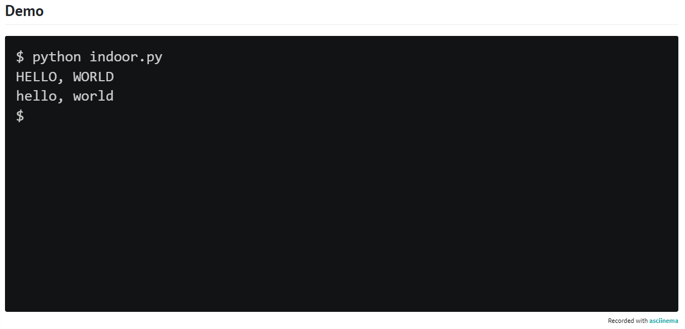
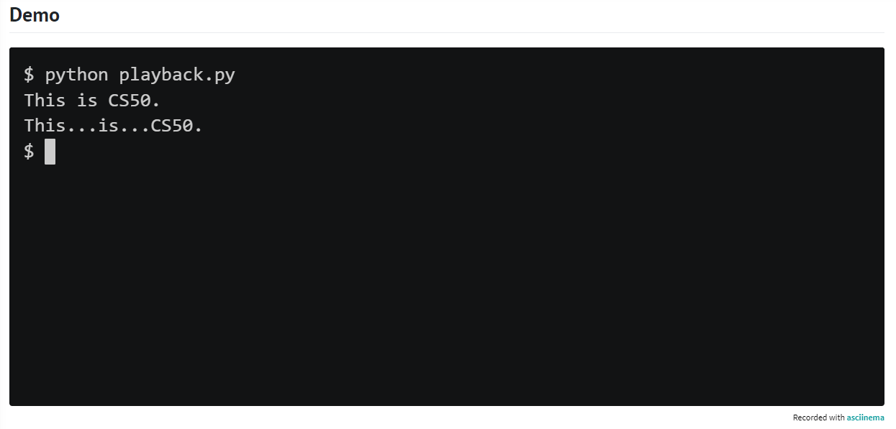

# Problem Set 0

##### TABLE OF CONTENTS
- [Indoor Voice](#indoor-voice)
  * [1. STATEMENT](#1-statement)
  * [1. MY SOLUTION](#1-my-solution)
- [Playback Speed](#playback-speed)
  * [2. STATEMENT](#2-statement)
  * [2. MY SOLUTION](#2-my-solution)

# Indoor Voice
## 1. STATEMENT
### Gets user input and outputs it in lowercase.
#### Instruction
WRITING IN ALL CAPS IS LIKE YELLING.

Best to use your “indoor voice” sometimes, writing entirely in lowercase.

In a file called indoor.py, implement a program in Python that prompts the user for input and then outputs that same input in lowercase. Punctuation and whitespace should be outputted unchanged. You’re welcome, but not required, to prompt the user explicitly, as by passing a str of your own as an argument to input.

## 1. MY SOLUTION
- [Gets user input and outputs it in lowercase.py](https://github.com/p3uj/edX-Harvard-University-CS50-s-Introduction-to-Programming-with-Python/blob/adcb51a8fc5a5789f9e74d3cb6e1c2f8d1f13ada/Problem%20Set%200/indoor-voice.py)

# Playback Speed
## 2. STATEMENT
### Gets user input and outputs it with spaces replaced by three periods.
#### Instruction
Some people have a habit of lecturing speaking rather quickly, and it’d be nice to slow them down, a la YouTube’s 0.75 playback speed, or even by having them pause between words.

In a file called playback.py, implement a program in Python that prompts the user for input and then outputs that same input, replacing each space with ... (i.e., three periods).

## 2. MY SOLUTION
- [Gets user input and outputs it with spaces replaced by three periods.py](https://github.com/p3uj/edX-Harvard-University-CS50-s-Introduction-to-Programming-with-Python/blob/ed02e025ac939fb20e41d9768d9afddb3bfd3083/Problem%20Set%200/playback.py)